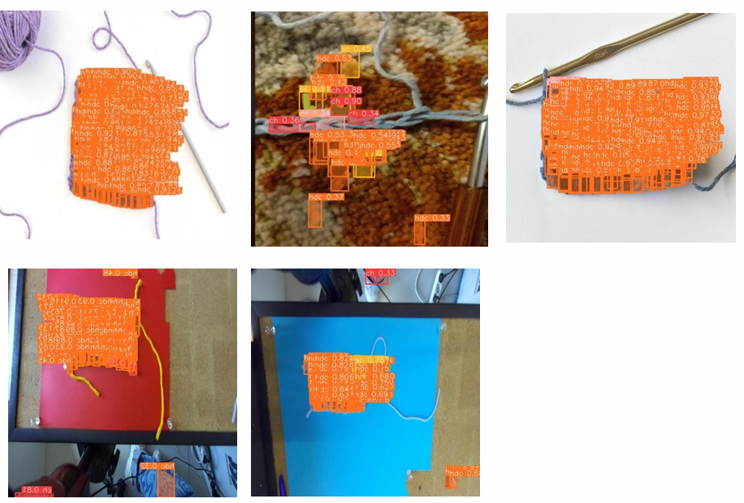
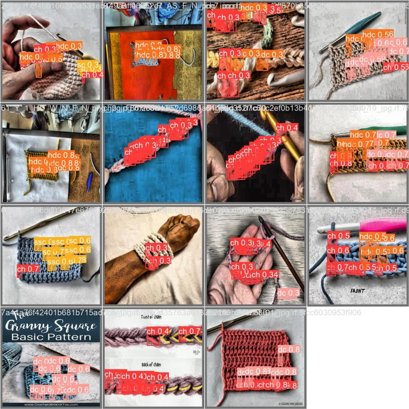

# Crochet Stitch Detection

This repository contains a YOLOv8-based image segmentation workflow for detecting crochet stitches. The main notebook demonstrates dataset download, model training, validation, and prediction using Ultralytics and Roboflow.





## Project Overview

The notebook performs the following tasks:

1. Verify the GPU environment with `nvidia-smi`.
2. Install and initialize `ultralytics` version `8.0.196`.
3. Set up a working directory and install `roboflow`.
4. Download the `crochet-stitch-detect` dataset from Roboflow, where the images were manually annotated for stitch segmentation.
5. Train a YOLOv8 segmentation model using `yolov8s-seg.pt` for 100 epochs with image size 640.
6. Display training results and validation predictions.
7. Run model validation and prediction on test images.
8. Show example prediction outputs.

## Notebook

The main notebook is:

- `projekt_weronika_arciuch.ipynb`

It also includes a Colab badge for opening the notebook directly in Google Colab.

## Required Packages

The notebook installs and uses:

- `ultralytics==8.0.196`
- `roboflow`
- `IPython`

## Key Commands

### Environment and package setup

```python
!nvidia-smi
!pip install ultralytics==8.0.196
!pip install roboflow
```

### Dataset download

```python
from roboflow import Roboflow
rf = Roboflow(api_key="7cCFvArHR0KwnFMrdbrM")
project = rf.workspace("akinorewek").project("crochet-stitch-detect")
version = project.version(12)
dataset = version.download("yolov8")
```

### Model training

```python
%cd {HOME}
!yolo task=segment mode=train model=yolov8s-seg.pt data={dataset.location}/data.yaml epochs=100 imgsz=640
```

### Validation and prediction

```python
!yolo task=segment mode=val model={HOME}/runs/segment/train3/weights/best.pt data={dataset.location}/data.yaml
!yolo task=segment mode=predict model={HOME}/runs/segment/train3/weights/best.pt conf=0.5 source={dataset.location}/test/images save=true
```

## Results

The notebook displays the training `results.png`, a validation prediction image, and a selection of saved prediction outputs from the `runs/segment/predict4` folder.

## Notes

- The dataset is downloaded to the local `datasets` folder.
- The training run output is stored under `runs/segment/train`.
- The notebook uses absolute Python `HOME` path variables to manage file and folder locations.
